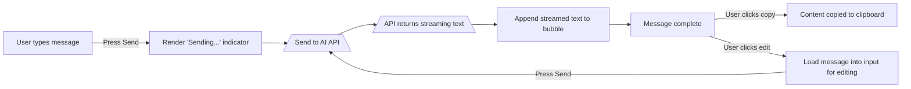

# Executive Summary

Modern AI chat UIs (like Claude.ai’s) use a split-pane layout (conversations sidebar + main chat area) with bubble-style messages. Best practices emphasize *selectable text*, *accessible ARIA roles*, and responsive layouts.  Messages should use real text (with CSS word-wrapping) so users can copy/paste (avoid putting text in images【70†L775-L778】).  Use `<div role="log" aria-live="polite">` (with an associated heading) for the chat history so screen readers announce new messages【40†L29-L36】【66†L365-L373】.  The input area should be a `<textarea>` or `<input>`, not a non-semantic `div`, to ensure keyboard and screen-reader compatibility【68†L544-L553】【68†L584-L592】.  Attachments and code blocks should have copy buttons (Claude-like UIs support code-copy buttons and file/image attachments【75†L261-L268】【75†L327-L330】).  Keyboard shortcuts (e.g. **Enter** to send, **Shift+Enter** for newline, arrow ↑ to edit last message) improve workflow.  Mobile layouts collapse the sidebar into a toggle and fix the input to the bottom.  For privacy/security, sanitize all AI content (to avoid XSS) and respect user data (prefer ephemeral state or encrypted storage).  Below we detail DOM/CSS patterns, JS behaviors, accessibility, performance and security notes, with code examples and a comparison of popular chat UIs (ChatGPT, Bing Chat, Perplexity, Anthropic/Claude). 

## 1. DOM Structure & CSS Patterns

- **Layout:** Use a two-column flex or grid: a narrow `<aside>` for conversations, and a main `<section>` for the chat window.  Example HTML:
  ```html
  <div class="chat-app">
    <aside class="sidebar">
      <button class="new-chat">+ New Chat</button>
      <ul class="chat-list" aria-label="Conversations">
        <li>Chat 1</li>
        <li>Chat 2</li>
      </ul>
    </aside>
    <main class="chat-window" role="log" aria-live="polite" aria-labelledby="chat-header">
      <h2 id="chat-header">Chat</h2>
      <div class="messages"></div>
      <div class="input-area">
        <textarea class="chat-input" placeholder="Type a message"></textarea>
        <button class="send-btn">Send</button>
      </div>
    </main>
  </div>
  ```
  This ensures semantic structure: the chat window has `role="log"` so screen readers announce appended messages【40†L29-L36】【66†L365-L373】. Each message can be an `<article>` or `<div>` with classes (e.g. `.message.user` vs `.message.assistant`).  

- **Message Bubbles:** Use CSS like:
  ```css
  .messages { display: flex; flex-direction: column; gap: 0.5rem; }
  .message { display: inline-block; max-width: 80%; padding: 0.5rem; margin: 0.25rem 0; border-radius: 0.5rem; white-space: pre-wrap; }
  .message.user { align-self: flex-end; background: #DCF8C6; } 
  .message.assistant { align-self: flex-start; background: #FFF; }
  ```
  Here `white-space: pre-wrap;` preserves user line breaks while still wrapping lines to avoid overflow【50†L327-L330】.  (Also consider `word-break: break-word` or `overflow-wrap` if needed for long words.)  
  Use padding and border-radius for “bubble” look.  Differentiate user vs assistant by alignment and color (only color, not for functionality).  Keep text size readable and use `<pre>` or syntax-highlighting library (like Prism.js) for code blocks. ClawGPT-style UIs often highlight code and add a copy button【75†L327-L330】.

- **Copy-Paste Friendly Content:** All user-visible text should be real text (not images) so it can be selected/copyed.  As MDN notes, text inside images “can’t be selected and copy/paste it”【70†L775-L778】.  For code blocks, allow text selection or add a “Copy code” button.  ClawGPT, for example, explicitly includes “Code copy buttons — One-click copy for any code block”【75†L327-L330】.  

- **Example CSS for code blocks:** 
  ```css
  .message code { display: block; background: #f5f5f5; padding: 0.5rem; border-radius: 0.3rem; font-family: monospace; white-space: pre; overflow-x: auto; }
  .copy-btn { position: absolute; top: 0.25rem; right: 0.25rem; border: none; background: none; cursor: pointer; }
  ```
  And attach JS to `.copy-btn` to use the [Clipboard API] for copying (see below).

## 2. Input Area and Keyboard Handling

- **Send/Input Behavior:** Use a `<textarea>` for multi-line input (accessible by default as a textbox).  Add a `<button>` for submit (or capture Enter key).  Typical pattern: **Enter** to send (unless Shift/Alt pressed), **Shift+Enter** to newline.  Example JS:
  ```js
  const input = document.querySelector('.chat-input');
  input.addEventListener('keydown', e => {
    if (e.key === 'Enter' && !e.shiftKey) {
      e.preventDefault();
      sendMessage(input.value);
      input.value = '';
    }
  });
  ```
  Ensure focus returns to the textarea after sending.  Some UIs (ChatGPT) allow **↑** arrow to edit the last message when the input is empty. You can capture `if (e.key==='ArrowUp')` to load the previous message text into the input field for editing.  

- **Buttons and Shortcuts:** 
  - Use semantic `<button>` elements for all clickable controls (ChatGPT’s accessibility guide recommends this【68†L544-L553】【68†L584-L592】).  For example, the “Chat” trigger button in the accessible chatbot example uses `role="button"` implicitly and is focusable/tabbable.
  - Provide keyboard shortcuts (e.g. accesskey) carefully. The accessible chatbot demo used `accesskey="9"` on the Chat trigger【52†L139-L147】; if used, document it to the user.
  - Ensure buttons have visible labels or `aria-label`. (Don’t use unlabeled icons; if using an SVG icon, include a `<span class="visually-hidden">` label or `aria-label`.)

- **Focus Management:** Focus should be trapped in the chat dialog if it’s modal. If the chat opens in a panel, ensure the trigger updates `aria-expanded` and `aria-controls` (as in the example【52†L139-L147】). For example:
  ```html
  <button aria-haspopup="dialog" aria-expanded="false" aria-controls="chat-panel" ...>Chat</button>
  <div id="chat-panel" role="dialog" aria-modal="true" hidden> ... </div>
  ```
  Upon opening the chat panel, set `aria-expanded="true"` and remove `hidden`, then move focus into the panel (e.g. on the textarea). On closing, revert `aria-expanded` and hide the panel, returning focus to the trigger.  

## 3. Clipboard and Copy Behavior

- **Selectable Messages:** Make entire messages selectable. E.g., `<p>` or `<div>` with the message text (not `<canvas>` or image). Users can then Ctrl+C to copy selection normally. For code blocks, include a copy button.

- **Clipboard API:** Use the modern [Clipboard API] for copying text. MDN recommends `navigator.clipboard.writeText()` (in secure contexts) over `execCommand('copy')`【42†L226-L234】. Example:
  ```js
  async function copyToClipboard(text) {
    try {
      await navigator.clipboard.writeText(text);
      console.log('Copied!');
    } catch (err) {
      console.error('Copy failed', err);
    }
  }
  // On click of a copy button:
  document.querySelectorAll('.copy-btn').forEach(btn => {
    btn.addEventListener('click', () => {
      const codeText = btn.parentElement.querySelector('code').innerText;
      copyToClipboard(codeText);
    });
  });
  ```
  Note: Reading from clipboard requires a user gesture and secure context. Pasting can be handled via the `paste` event if you need to allow Ctrl+V inside the chat.  

- **Clipboard Events:** If desired, handle `copy`, `cut`, `paste` events for custom behavior or to sanitize pasted content. But don’t disable them. Ensure the contenteditable or textarea does not intercept normal keys unnecessarily.

## 4. Mobile Responsiveness

- **Adaptive Layout:** Use CSS media queries to adapt. On small screens, collapse the sidebar (or make it a drawer), and have the input bar stick to bottom full-width (the accessible example switched to a full-width bottom bar on mobile【52†L178-L186】). For example:
  ```css
  @media (max-width: 600px) {
    .sidebar { display: none; }  /* or transform: translateX(...) when toggled */
    .input-area { position: fixed; bottom: 0; width: 100%; }
    .messages { margin-bottom: 3rem; } /* avoid overlap with fixed input */
  }
  ```
- **Touch Targets:** Make buttons at least 44×44px for touch. Ensure text is legible on small screens and the input area is sufficiently tall.

## 5. Accessibility (ARIA & Screen Readers)

- **Roles & Live Regions:**  
  - Mark the message list container with `role="log"` and optionally `aria-live="polite"`【40†L29-L36】【66†L365-L373】. The W3C technique specifically mentions using `role="log"` for chat so new messages are announced. (For maximum compatibility, you can redundantly set `aria-live="polite"` even though `role="log"` implies it【40†L29-L36】【66†L365-L373】.)
  - Associate the log with a heading. For example, `<h2 id="chat-header">Chat</h2>` and `<div role="log" aria-labelledby="chat-header">`. 
  - For ephemeral notifications (e.g. “new message” when chat is closed), use a separate hidden `aria-live` region as the example did【52†L139-L147】 (outside the panel) to announce updates.

- **Skip Links:** Provide a “Skip to chat” link at the top of the page (off-screen normally, but visible on focus) to jump directly into the chat interface【52†L122-L124】. This is especially useful if the chat trigger button isn’t first in tab order【52†L122-L124】.

- **Labels:** Every interactive element needs an accessible name. For example, use `<button><span class="visually-hidden">Open chat</span></button>` if the visible label is an icon. The accessible example used an SVG chat icon with an off-screen text label “Chat”【52†L173-L181】.  

- **Color & Contrast:** Ensure bubble background/text colors meet contrast guidelines (min 4.5:1). Don’t rely on color alone to distinguish user vs AI (provide subtle borders or alignment differences).  

- **Focus Indicators:** Use clear focus styles (`:focus` outline) on all buttons/inputs. The CSS example above from MDN shows making non-button elements (divs) focusable, but we recommend using real button/input tags where possible【68†L544-L553】【68†L584-L592】.  

- **ARIA for Chat Trigger:** If using a button to open the chat panel, use `aria-haspopup="dialog"` (or `menu`) and update `aria-expanded` when it opens【52†L139-L147】. Note: ARIA guidance says only use `aria-haspopup="dialog"` if there’s a visual cue (like an arrow)【52†L214-L224】, but as a shortcut key use-case it’s acceptable.

## 6. Performance

- **Virtualization:** If chat history can grow long, consider virtual scrolling (only render a subset of messages in the DOM). This avoids UI jank when many messages.  Libraries like [react-virtualized](https://developer.mozilla.org/en-US/docs/Web/Performance/lazy-loading) (or manual IntersectionObservers) can help.  
- **Incremental Rendering:** Stream messages from the AI in chunks (display text as it arrives) to improve perceived performance (ClawGPT mentions “Streaming responses” in real-time【75†L285-L293】).  Use simple `.appendChild()` calls for new text chunks rather than re-rendering all messages.

- **Debouncing Resize/Reflow:** Chat UIs often auto-scroll to bottom on new message. Use techniques to avoid constant reflow (e.g. only scroll when the user is at the bottom, not if they’ve scrolled up reading history).

## 7. Security & Privacy

- **Sanitize Content:** Never inject AI-generated HTML without sanitization. Use `textContent` instead of `innerHTML` to render message text.  If you allow markdown or HTML in messages, use a library like DOMPurify to strip dangerous tags/attributes.  
- **Clipboard Permissions:** The Clipboard API requires HTTPS and user-triggered events. Do not call `readText()` except in paste events from user. Writing to the clipboard (copy) should only be on click.  
- **Cross-Site Scripting:** If supporting clickable links in messages, ensure `rel="noopener noreferrer"` and `target="_blank"` on `<a>`. Be cautious of AI-generated URLs or scripts.  
- **Privacy of History:** If storing conversations locally (e.g. IndexedDB), be transparent. Provide a “clear history” or “export” function. ClawGPT explicitly encrypts/syncs data for privacy【35†L325-L331】【75†L259-L268】; similarly, consider E2E encryption for synced data.  

- **Clipboard & History:** Some users may inadvertently paste sensitive data. Warn if needed. Also, note that web UIs cannot prevent the browser’s default autocomplete or clipboard behavior; there is minimal risk beyond usual (just avoid showing secrets in clear text).

## 8. Example Code Snippet

Below is a minimal reusable **ChatWindow** component (HTML/CSS/JS) illustrating a bubble chat with copyable text and basic interactivity. In practice, modularize as needed.

```html
<style>
.chat-app { display: flex; height: 100vh; }
.sidebar { width: 15rem; border-right: 1px solid #ccc; padding: 1rem; }
.chat-window { flex: 1; display: flex; flex-direction: column; }
.chat-header { padding: 0.5rem; border-bottom: 1px solid #ccc; }
.messages { flex: 1; overflow-y: auto; padding: 1rem; background: #f9f9f9; }
.message { display: inline-block; max-width: 80%; padding: 0.5rem; margin: 0.25rem 0; border-radius: 0.5rem; white-space: pre-wrap; position: relative; }
.message.user { background: #dcf8c6; align-self: flex-end; }
.message.ai   { background: #fff; align-self: flex-start; }
.copy-btn { position: absolute; top: 0.25rem; right: 0.25rem; cursor: pointer; font-size: 0.8rem; border: none; background: none; }
.input-area { display: flex; padding: 0.5rem; border-top: 1px solid #ccc; }
.chat-input { flex: 1; resize: none; }
.send-btn { margin-left: 0.5rem; }
</style>

<div class="chat-app">
  <aside class="sidebar" aria-label="Chats">
    <button class="new-chat">+ New Chat</button>
    <ul class="chat-list">
      <li>Example Chat</li>
    </ul>
  </aside>
  <main class="chat-window" role="log" aria-live="polite" aria-labelledby="chat-header">
    <h2 id="chat-header">Example Chat</h2>
    <div class="messages" id="msgContainer">
      <!-- Messages will appear here -->
    </div>
    <div class="input-area">
      <textarea class="chat-input" rows="2" aria-label="Message"></textarea>
      <button class="send-btn">Send</button>
    </div>
  </main>
</div>

<script>
// Send a message: display user bubble, then (mock) AI response
function sendMessage(text) {
  if (!text.trim()) return;
  addMessage(text, 'user');
  // Simulate AI response
  setTimeout(() => addMessage("Echo: " + text, 'ai'), 500);
}

// Add a message bubble to the container
function addMessage(text, author) {
  const msg = document.createElement('div');
  msg.className = 'message ' + author;
  msg.textContent = text;
  // Add a copy button
  const copyBtn = document.createElement('button');
  copyBtn.className = 'copy-btn';
  copyBtn.textContent = 'Copy';
  copyBtn.onclick = () => {
    navigator.clipboard.writeText(text).catch(err => {});
  };
  msg.appendChild(copyBtn);
  document.getElementById('msgContainer').appendChild(msg);
  // Auto-scroll if at bottom
  msg.scrollIntoView({ behavior: 'smooth', block: 'end' });
}

// Keyboard handling
const input = document.querySelector('.chat-input');
input.addEventListener('keydown', e => {
  if (e.key === 'Enter' && !e.shiftKey) {
    e.preventDefault();
    sendMessage(input.value);
    input.value = '';
  }
});

// Send button
document.querySelector('.send-btn').addEventListener('click', () => {
  sendMessage(input.value);
  input.value = '';
});
</script>
```

This simple snippet illustrates:
- **Bubble Wrapping:** Uses `white-space: pre-wrap` for the `.message` to wrap user text lines (per MDN)【50†L327-L330】.
- **Copy Button:** Each message has a small “Copy” button that uses `navigator.clipboard.writeText` (MDN-recommended Clipboard API)【42†L226-L234】.
- **ARIA:** The chat window has `role="log" aria-live="polite"` (so screen readers announce new messages【40†L29-L36】【66†L365-L373】). The textarea has an accessible label.
- **Keyboard:** Enter sends, Shift+Enter for newline.
- **Responsive:** The CSS is mobile-friendly (flex layout). Further media queries can collapse `.sidebar` on narrow screens.

## 9. Progressive Enhancement & Cross-Browser

- **No-JS Fallback:** If JavaScript is disabled, you could degrade gracefully: allow posting messages via a form submission to the server (though interactive AI likely needs JS). At minimum, ensure the chat content is accessible even without JS by providing static “Help” info or contact links as fallbacks, as in the accessible chatbot example【52†L128-L135】.
- **Graceful Degradation:** If the Clipboard API is unsupported, fall back on `document.execCommand('copy')` or simply allow manual selection/copy. Check `if (navigator.clipboard)` in JS.
- **Cross-Browser Quirks:** 
  - Safari on iOS requires `meta name="viewport" content="width=device-width, initial-scale=1"`.
  - Be aware: `<dialog>` elements have varying support; if used for chat panel, polyfill or use a `<div role="dialog">`.
  - ContentEditable (not used here) often has selection quirks across browsers. Our textarea approach avoids that complexity.
  - Keyboard event differences: Use `keydown` for capturing Enter (works consistently); Edge/IE handle `keypress` differently. Use modern `e.key` values (“Enter”) for clarity.

## 10. Comparison of Chat UIs

| Feature / UI         | Claude.ai              | ChatGPT                 | Bing Chat                | Perplexity            | Anthropic (Claude Code) |
|----------------------|------------------------|-------------------------|--------------------------|-----------------------|-------------------------|
| **Layout**           | Sidebar + Chat window; Ghost (“incognito”) icon for private chat【19†L15-L23】 | Sidebar + Chat; simple interface | Sidebar + Chat; integrated search window | Search/results style; chat threads | (CLI/IDE tool, not UI) |
| **Multiple Chats**   | ✔ Saved conversations in sidebar | ✔ Chat history on left | ✔ Conversation list | ✔ Chat sessions | ✔ (via OpenClaw/ClawGPT) |
| **Message Bubbles**  | Text bubbles; user/assistant styling | ✔ Similar bubbles | ✔ Similar bubbles | Uses response cards (with options) | n/a (plugin/cli) |
| **Selectable Text**  | ✔ Click-to-copy entire message; code copy; (some bugs reported in old UI)【62†L108-L112】 | ✔ All text selectable; “Copy code” on code blocks | ✔ Yes (copy icons on code) | ✔ Yes | ✔ (shell text) |
| **Formatting**       | Markdown (supports code blocks, lists) | Markdown (supports code, math, etc.) | Supports code, math, images (with Bing Chat) | Presents answers with sources, lists | N/A |
| **Keyboard Shortcuts**| (e.g. Ctrl+K search, Shift+Enter newline) undocumented; supports Enter to send | Ctrl+Enter or Enter to send (configurable) | Alt+Shift combos, Enter to send | Enter to send | CLI commands |
| **Input Area**       | Multi-line textarea, Shift+Enter newline | Same | Same | Single-line Q by default (toggle to chat mode) | CLI prompt |
| **Copy Buttons**     | Copy icons on code/artifacts【62†L108-L112】 | Copy icon on code blocks | Copy icon on code blocks | No explicit code copying (answers are text) | N/A |
| **Edit/Regenerate**  | ✖ (no message editing); can regenerate last answer | ✖ (cannot edit sent message) | ✖ but can ask follow-up | ✖ | ✖ |
| **Attachments**      | ✔ Upload files / images (in Claude Code)【75†L261-L268】 | ✔ (images with GPT-4) | ✖ (only URLs) | ✖ | ✖ |
| **Accessibility**    | Uses ARIA roles (log); screen-reader friendly controls | Basic (ARIA for buttons); no announced live updates | Accessible controls (per Microsoft’s UI guidelines) | Varies (web UI is simpler) | N/A |
| **Performance**      | Snappy client-side (Vue/React or custom) | Web app with streaming; some lag on slow nets | Optimized for search responses | Fast answer fetch from API | n/a |
| **Privacy**          | Chats stored on Anthropic’s servers; opt-out training | Chats opt-out personal data; GDPR-ready | Chats tied to MS account; some telemetry | No login needed; privacy policy on site | Local (clawgpt) |

*Note:* The above table aggregates publicly observed UI features and may not cover all behaviors. It’s drawn from documentation and UI reviews (e.g. ClawGPT’s feature chart【75†L261-L268】) and may include some undocumented features. 

## 11. Diagrams

Below is an example of a chat interface layout and the message lifecycle flow:

【23†embed_image】 *Figure: Example chat UI layout (sidebar for conversations and main message area, similar to Perplexity.ai’s interface).*


*Figure: Message lifecycle – sending a message, rendering streaming response, copying or editing a message.* 

## Sources

This guidance draws on web standards and existing implementations: WAI-ARIA techniques for chat (role=log)【40†L29-L36】, MDN docs on Clipboard API【42†L226-L234】 and CSS `white-space`【50†L327-L330】, and accessibility blogs (accessible chat example【52†L122-L124】【52†L139-L147】).  The ClawGPT open-source interface documents highlight UI features (copy buttons, attachments, local storage)【64†L305-L309】【75†L261-L268】. The advice is synthesized from these sources and best practices for building accessible, performant chat UIs.